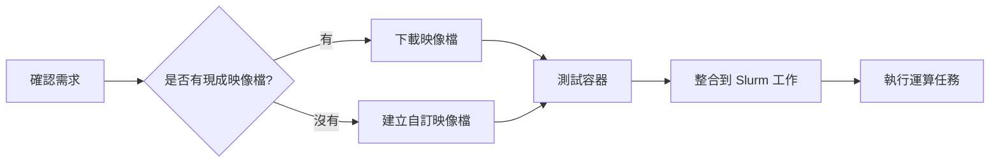

# 容器相關

## 什麼是容器

容器（Container）是一種輕量級的虛擬化技術，可以將應用程式及其所有相依套件、函式庫、設定檔打包在一起，形成一個獨立的執行環境。容器技術讓應用程式能夠在不同的運算環境中保持一致的執行方式。

### 容器的特點

**隔離性**
- 每個容器都有獨立的檔案系統、程序空間和網路介面
- 容器內的程式不會影響到主機系統或其他容器
- 可以在同一台機器上執行多個不同環境的容器

**可攜性**
- 容器映像檔可以在不同的機器和平台上執行
- 開發環境與正式環境可以使用相同的容器配置
- 容易分享和重現特定的軟體環境

**輕量化**
- 容器直接使用主機的作業系統核心，不需要完整的虛擬機器
- 啟動速度快，資源消耗少
- 可以在同一台機器上執行大量容器

**版本控制**
- 容器映像檔可以像程式碼一樣進行版本管理
- 容易回溯到先前的環境設定
- 便於追蹤環境變更

## 容器 vs 虛擬機器

| 特性 | 容器 | 虛擬機器 |
|------|------|----------|
| 啟動速度 | 秒級 | 分鐘級 |
| 資源消耗 | 低（共用核心） | 高（完整作業系統） |
| 隔離程度 | 程序級隔離 | 完全隔離 |
| 映像檔大小 | MB 級 | GB 級 |
| 效能 | 接近原生 | 有虛擬化損耗 |

## HPC 環境中的容器技術

在 HPC 環境中，我們使用 **Singularity**（現稱為 Apptainer）作為容器平台。Singularity 是專為 HPC 和科學運算設計的容器解決方案，相較於一般的 Docker，它具有以下優勢：

**安全性**
- 不需要 root 權限即可執行容器
- 使用者在容器內外保持相同的身份
- 適合多使用者共享的 HPC 環境

**效能**
- 直接存取主機的 GPU、高速網路等硬體資源
- 針對 HPC 工作負載最佳化
- 支援 MPI（Message Passing Interface）平行運算

**相容性**
- 可以直接執行 Docker 映像檔
- 支援從 Docker Hub、NGC 等平台下載映像檔
- 整合 HPC 排程系統（如 Slurm）

## 何時需要使用容器

### 使用情境

**1. 平台上沒有需要的軟體或版本**

當 HPC 平台沒有提供你需要的軟體，或是軟體版本不符合需求時：

```bash
# 例如：需要特定版本的 Python 和套件
# 平台提供：Python 3.8
# 你需要：Python 3.11 + 特定版本的 TensorFlow

# 使用容器可以自訂完整的環境
```

**2. 需要複雜的軟體相依性**

當你的程式需要多個相依套件，且這些套件之間有複雜的版本相依關係：

- 深度學習框架（TensorFlow、PyTorch）與特定版本的 CUDA、cuDNN
- 生物資訊軟體套件與其相依的函式庫
- 特定版本的編譯器和函式庫組合

**3. 環境重現性需求**

當你需要確保研究結果可以重現：

- 發表論文時提供完整的運算環境
- 在不同的 HPC 平台上執行相同的實驗
- 與團隊成員共享一致的開發環境

**4. 測試不同版本的軟體**

當你需要比較不同軟體版本的效能或結果：

```bash
# 在不同的容器中測試不同版本
singularity exec pytorch_1.12.sif python train.py
singularity exec pytorch_2.0.sif python train.py
```

**5. 隔離實驗環境**

當你需要執行可能影響系統的操作，或是測試不穩定的軟體：

- 避免污染主機環境
- 測試新版本軟體而不影響現有工作
- 安全地執行第三方程式

**6. 使用預先建置的專業環境**

許多組織提供優化過的容器映像檔：

- NVIDIA NGC：深度學習框架、HPC 應用程式
- BioContainers：生物資訊工具
- 官方軟體容器：特定軟體的官方映像檔

### 實際範例

**範例 1：使用特定版本的深度學習框架**

```bash
# 從 NGC 下載 PyTorch 容器
singularity pull docker://nvcr.io/nvidia/pytorch:23.12-py3

# 使用容器執行訓練程式
singularity exec --nv pytorch_23.12-py3.sif python train.py
```

**範例 2：建立自訂的研究環境**

```bash
# 建立包含特定版本套件的容器
# 使用 definition file 定義環境
singularity build my_research.sif my_research.def

# 在容器中執行分析
singularity exec my_research.sif python analysis.py
```

**範例 3：與團隊共享環境**

```bash
# 建立容器映像檔
singularity build shared_env.sif environment.def

# 分享給團隊成員（只需複製 .sif 檔案）
# 所有人都能使用完全相同的環境
singularity exec shared_env.sif python project.py
```

## 不需要使用容器的情況

以下情況通常不需要使用容器：

1. **平台已提供所需軟體**：如果 module 系統已有適合的版本
2. **簡單的腳本程式**：只使用標準函式庫的程式
3. **效能極度敏感**：某些情況下容器可能有微小的效能損失
4. **學習基本操作**：初學者建議先熟悉基本的 HPC 操作

## 容器使用流程

在 HPC 環境中使用容器的典型流程：



### 步驟說明

1. **確認需求**：明確你需要的軟體和版本
2. **尋找映像檔**：在 Docker Hub、NGC 等平台搜尋
3. **下載或建立**：使用現成映像檔或自行建立
4. **測試驗證**：在互動模式下測試容器功能
5. **撰寫工作腳本**：將容器整合到 Slurm 批次工作
6. **提交執行**：在 HPC 叢集上執行任務

## 後續章節

- [從 NGC 下載映像檔](./ngc.md)：如何從 NVIDIA GPU Cloud 取得預先建置的容器
- [執行容器](./run.md)：Singularity 的基本執行方式和參數
- [製作映像檔](./build-image.md)：如何建立自訂的容器映像檔

## 常見問題

**Q: 容器會影響程式效能嗎？**

A: Singularity 容器的效能接近原生執行，特別是在 HPC 環境中。對於 GPU 運算和 MPI 平行運算，效能損失通常可以忽略。

**Q: 容器內的檔案如何與主機共享？**

A: Singularity 預設會掛載使用者的家目錄和當前工作目錄，你可以直接存取主機上的檔案。

**Q: 可以在容器內使用 GPU 嗎？**

A: 可以，使用 `--nv` 參數即可讓容器存取主機的 NVIDIA GPU。

**Q: 容器映像檔會佔用很多空間嗎？**

A: 這取決於映像檔的內容。簡單的環境可能只有幾百 MB，包含完整深度學習框架的映像檔可能有數 GB。建議定期清理不需要的映像檔。

**Q: Docker 映像檔可以在 Singularity 上執行嗎？**

A: 可以，Singularity 可以直接執行 Docker 映像檔，或是將 Docker 映像檔轉換成 Singularity 格式（.sif）。